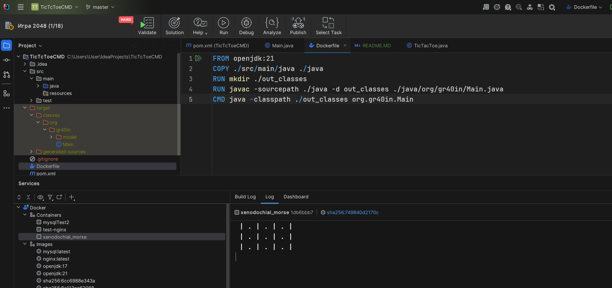
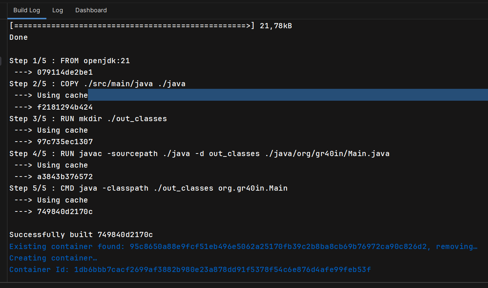

Бесполезный код - но докер отрабатывает =)

[Dockerfile](Dockerfile)
```dockerfile
FROM openjdk:21
COPY ./src/main/java ./java
RUN mkdir ./out_classes
RUN javac -sourcepath ./java -d out_classes ./java/org/gr40in/Main.java
CMD java -classpath ./out_classes org.gr40in.Main
```


